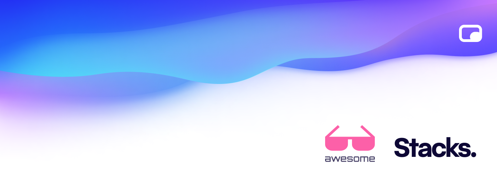

## Awesome Stacks.js  

> A curated list of awesome things relating the Stacks.js ecosystem

- [Resources](#resources)
  - [Official Resources](#official-resources)
  - [External Resources](#external-resources)
  - [Job Portal](#job-portal)
  - [Community](#community)
  - [Conferences](#conferences)
  - [Podcasts](#podcasts)
  - [YouTube Channels](#youtube-channels)
  - [Tutorials](#tutorials)
  - [Blog Posts](#blog-posts)
  - [Courses](#courses)
- [Official Stacks](#official-stacks)
  - [Table](https://github.com/stacksjs/table) (Data tables with ease)
  - [Calendar](https://github.com/stacksjs/calendar) (Add to Calendar utilities—iCal, Google, and more)
  - [Command Palette](https://github.com/stacksjs/command-palette) (`⌘ + k` for the web)
  - [Date Picker](https://github.com/stacksjs/date-picker) (Beautiful, modern date picker)
  - [File Manager](https://github.com/stacksjs/file-manager) (Build your own file manager—like Dropbox or Google Drive)
  - [Image](https://github.com/stacksjs/image) (Modern image experience)
  - [Video](https://github.com/stacksjs/video) (Modern video experience)
  - [Audio](https://github.com/stacksjs/audio) (Modern audio experience)
  - [Web3](https://github.com/stacksjs/web3) (Solana support, cross-chain core _Ethereum & Cardano drivers coming._)
    - [Wallets](https://github.com/stacksjs/wallets) (Wallet Authentication)
    - [NFT](https://github.com/stacksjs/nft) (NFTs, Candy Machine mechanisms, and more.)
    - [DeFi](https://github.com/stacksjs/defi) (Cross-chain DeFi engine, including staking support)
    - [DAO](https://github.com/stacksjs/dao) (Powerful toolkit for DAO governance)
- [Open Source Stacks](#open-source-stacks)
  - [UI Component Libraries](#ui-component-libraries)
  - [Function Libraries](#function-libraries)
- [Projects Using Stacks](#projects-using-stacks)
  - [Open Source](#open-source)
  - [Commercial Products](#commercial-products)
  - [Apps & Websites](#apps-and-websites)
  - [Enterprise Usage](#enterprise-usage)
  - [Integrations](#integrations)
- [Scaffold](#scaffold)

## Resources

### Official Resources

- [Official Guide](http://stacks.ow3.org/guide/)
- [API Reference](http://stacks.ow3.org/api/)
- [GitHub Repo](https://github.com/stacksjs/stacks)
- [Release Notes](https://github.com/stacksjs/stacks/releases)
- [Style Guide](http://stacks.ow3.org/style-guide/)
- [Stacks.js News](https://news.ow3.org/)

### External Resources

- [This could be your link](https://stacks.ow3.org) by @you

### Job Portal

- [This could be your link](https://stacks.ow3.org) by @you

### Community

- [Twitter](https://twitter.com/stacksjs)
- [Discord](https://discord.ow3.org/)
- [Discussions](https://github.com/stacksjs/stacks/discussions/)

### Conferences

- [Your Conf](https://ow3.org)

### Podcasts

- [Your Pod](https://ow3.org)

### YouTube Channels

- [Your Channel](https://ow3.org)

### Tutorials

- [Your Tutorial](https://ow3.org)

### Blog Posts

- [Your Post](https://ow3.org)

### Courses

- [Your Course](https://ow3.org)

## Official Stacks

- [Table](https://github.com/stacksjs/table) (Q3 - Data tables with ease)
- [Calendar](https://github.com/stacksjs/calendar) (Q3 - Add to Calendar utilities—iCal, Google, and more)
- [Command Palette](https://github.com/stacksjs/command-palette) (Q3 - `⌘ + k` for the web)
- [Date Picker](https://github.com/stacksjs/date-picker) (Q3 - Beautiful, modern date picker)
- [File Manager](https://github.com/stacksjs/file-manager) (Q3 - Build your own file manager—like Dropbox or Google Drive)
- [Image](https://github.com/stacksjs/image) (Q3 - Modern image experience)
- [Video](https://github.com/stacksjs/video) (Q3 - Modern video experience)
- [Audio](https://github.com/stacksjs/audio) (Q3 - Modern audio experience)
- [Web3](https://github.com/stacksjs/web3) (Q3 - Solana support, cross-chain core _Ethereum & Cardano drivers coming._)
  - [Wallets](https://github.com/stacksjs/wallets) (Q3 - Wallet Authentication)
  - [NFT](https://github.com/stacksjs/nft) (Q3 - NFTs, Candy Machine mechanisms, and more.)
  - [DeFi](https://github.com/stacksjs/defi) (Q4 - Cross-chain DeFi engine, including staking support)
  - [DAO](https://github.com/stacksjs/dao) (Q4 - Powerful toolkit for DAO governance)

## Open Source Stacks

_A collection of 3rd-party stacks/libraries._

### UI Component Libraries

- [Your Stack](https://ow3.org)

### Function Libraries

- [Your Stack](https://ow3.org)

## Projects Using Stacks

_A collection of projects using Stacks._

### Open Source

- [Your OS](https://ow3.org) - minor description

### Commercial Products

- [Your Product](https://ow3.org) - minor description

### Apps And Websites

- [Your App/Website](https://ow3.org) - minor description

### Enterprise Usage

- [Your Enterprise](https://ow3.org) - minor description

### Integrations

_Integrations with services and/or other frameworks._

- [Your Integration](https://ow3.org)

#### Inspect

_Inspecting & debugging._

- [Vue.js devtools](https://github.com/vuejs/vue-devtools) - Chrome devtools extension for debugging Stacks applications.

#### Docs

_Create documentation._

- [VitePress](https://vitepress.vuejs.org/) - Stacks comes with first-party support for VitePress.

#### Test

- [Vitest](https://vitest.dev/) - Stacks comes with first-party support for Vitest.

#### IDEs

_Editor plugins & integrations._

##### Visual Studio Code

- [Volar](https://github.com/johnsoncodehk/volar) - Stacks recommends Volar for VS Code. 

### Scaffold

_Scaffold / boilerplate / seed / starter kits._

- [artisan-init](https://github.com/stacksjs/stacks/tree/main/.stacks/artisan) - Simple CLI for scaffolding Stacks.js projects.
- [ts-starter](https://github.com/ow3org/ts-starter) - TypeScript Starter template to simplify creating & distributing your next npm package.
- [vue-starter](https://github.com/ow3org/vue-starter) - Vue Component Library Starter kit to help kick-start development of your next library.
- [web-components-starter](https://github.com/ow3org/web-components-starter) - Web Components Starter template to help kick-start development of a framework-agnostic component library.
- [composable-starter](https://github.com/ow3org/composable-starter) - Composable Starter Kit to simplify creating & distributing your next npm package/s.

